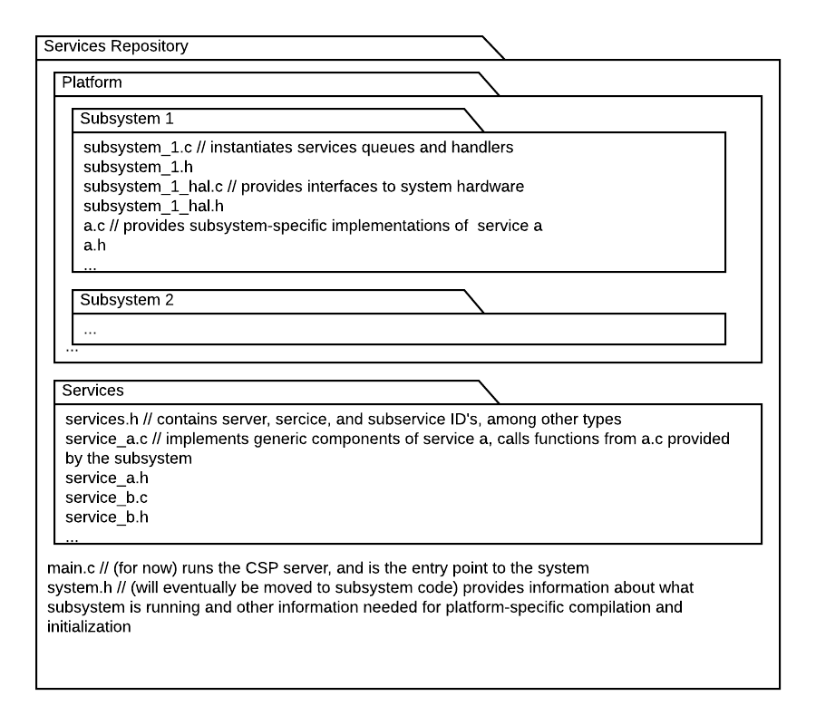
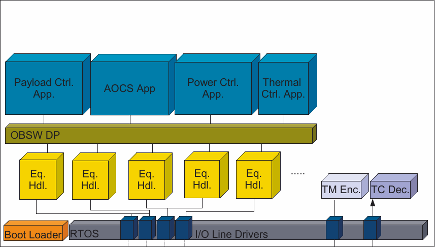

## ex2 command handling demo
This repo will include hardware agnostic/generic implementations of the ECSS services

## To run locally

[Install Docker](https://docs.docker.com/get-docker/) on your machine, and start it running in the background

In the root directory of this project, run:

```
sudo docker build --tag satellite_sim:latest .
```
To build the Docker image. This will take a few minutes (up to ~20 minutes): grab a coffee and chill ☕️. *This will need to be redone after every change to the code*, but subsequset builds are MUCH faster.

Now run:

```
sudo docker run --rm -it --network=host satellite_sim:latest
```
To begin the image. This will start the zmq proxy and run the satelliteSim with this project in it.

##### The design choices for this Repo are outlined in [this](https://docs.google.com/document/d/1lwsXxDpW5vtddGfX8-NMvWY7z-IfMumLlIke-QgDpBo/edit) document

## File structure



## Design structure


